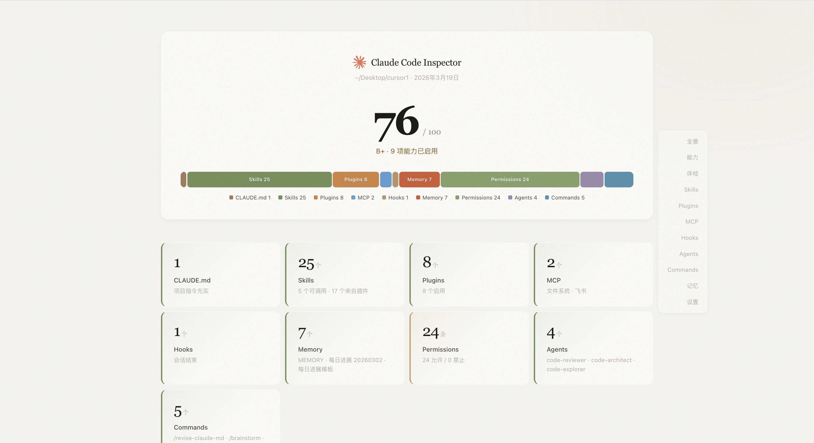
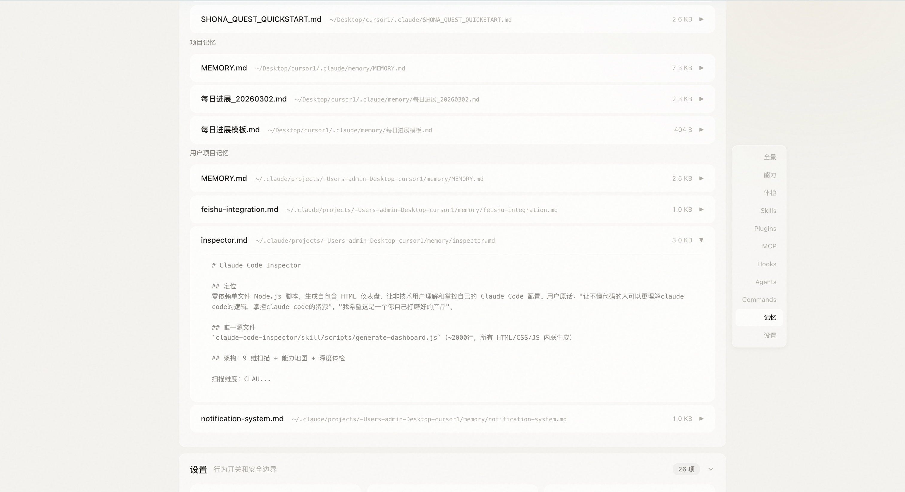

# Claude Code Inspector

一条命令，一个 HTML 文件 — 看清你的 Claude Code 能做什么、不能做什么、哪里该优化。

零依赖，本地运行，密钥自动脱敏。



## 使用方式

### 方式一：下载运行（推荐）

1. 点击本页绿色 **Code** 按钮 → **Download ZIP**，解压到任意位置
2. 打开 Claude Code，说一句：

```
帮我运行一下 node ~/Downloads/claude-code-inspector-main/skill/scripts/generate-dashboard.js
```

（路径换成你实际解压的位置）

3. 当前目录会生成 `claude-code-inspector.html`，双击打开就能看到报告

### 方式二：一键安装（需终端能访问 GitHub）

```bash
curl -fsSL https://raw.githubusercontent.com/pxx-design/claude-code-inspector/main/install.sh | bash
```

安装后在 Claude Code 里输入 `/inspect` 即可生成报告。

## 你会得到什么

### 配置全景 + 健康评分

一眼看到 9 个维度的配置数量，以及 0-100 的健康评分和等级。

### 能力地图

10 项能力按重要程度分层展示，一眼看出哪些已开启、哪些还没配置：

- **核心**：项目规范（CLAUDE.md）、跨会话记忆
- **扩展**：搜索互联网、操作浏览器、连接团队工具、社区插件
- **基础**：读写文件、执行终端、自动化工作流、自动提交

### 深度体检

30+ 项检查，每条问题都能展开看说明 + 修复建议，可自动修复的条目带「复制修复命令」按钮 — 点一下，粘贴到终端就能修好。


### 资源详情

9 个可折叠面板，展示所有配置的详细信息：

| 板块 | 内容 |
|------|------|
| Skills | 项目级、用户级、插件提供的技能 |
| Plugins | 已安装插件及启用/屏蔽状态 |
| MCP Servers | 已配置的外部工具服务 |
| Hooks | 事件触发的自动化流程 |
| Agents | 来自插件、项目、用户的专家角色 |
| Commands | 自定义斜杠指令 |
| 记忆 | CLAUDE.md 和 memory 文件预览 |
| 设置 | 权限规则、环境变量、Git 配置 |



## 安全

所有 API 密钥、Token、密码在报告中自动打码。生成的 HTML 可以安全分享。

## 要求

- Node.js >= 16

## 原理

一个单文件 Node.js 脚本（约 2000 行，零依赖）：

1. 扫描 `~/.claude/` 和 `.claude/` 下的所有配置文件
2. 检测 10 项能力（MCP、插件、权限、设置）
3. 运行 30+ 条健康检查规则
4. 生成自包含的 HTML 仪表盘

所有数据不离开你的电脑。

## 卸载

```bash
rm -rf ~/.claude/skills/inspector/
```

## License

MIT
